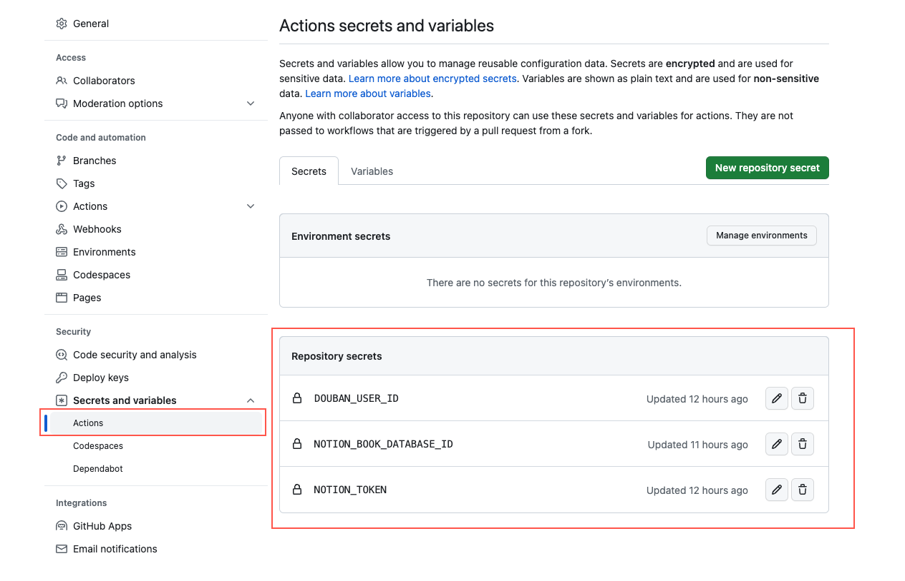

# douban_book_to_notion

## Introduction
### Use douban's rss source to sync book reading status to the database of notion, this is increasing update, the status includes reading and wanna read, read.

## How to Use
### 1. Git clone the repository.
### 2. Creating a notion integretion bot and copy the notion integration token. [Learn more](https://developers.notion.com/docs/create-a-notion-integration#step-1-create-an-integration)
### 3. Duplicate the [notion template](https://benmix.notion.site/d7bb93e54a9e43b3ad04762492880f6f?v=8a0e46806aaa4a2d905639d4c3043bcc)

### 4. Add your created integretion connect to your notion's database. [Learn more](https://developers.notion.com/docs/create-a-notion-integration#step-2-share-a-database-with-your-integration)
### 5. Copy the cloned template's database id. Please save it, We will use it soon. [Learn more](https://developers.notion.com/docs/create-a-notion-integration#step-3-save-the-database-id)
### 6. Goto your douban homepage, Copy your douban's ID, Please save it. We will use it soon.

### 7. Setting secrets for git actions. Add **NOTION_TOKEN**([STEP 2](#2-creating-a-notion-integretion-bot-and-copy-the-notion-integration-token-learn-more)), **NOTION_BOOK_DATABASE_ID**([STEP 5](#5-copy-the-cloned-templates-database-id-please-save-it-we-will-use-it-soon-learn-more)) and **DOUBAN_USER_ID** ([STEP 6](#6-goto-your-douban-homepage-copy-your-doubans-id-please-save-it-we-will-use-it-soon)) to your repository actions configuration.

### 8. First Sync, You must run sync_full action to full sync your douban's book reading data.
### 9. Finally, set the schedule to execute the sync_rss action. you can update the workflow configuration to modify the timing.

## Credits
### Thanks bambooom's [douban-backup](https://github.com/bambooom/douban-backup)

## License
### [MIT License](/LICENSE)

