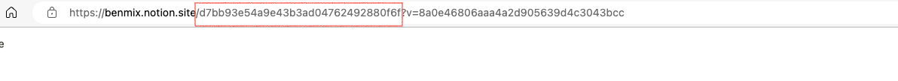

# douban_book_to_notion

## Introduction
**Use douban' rss source to sync book reading status to the database of notion, this is increasing update, the status includes reading and wanna read, read.**

## How to Use
1. **Goto your douban homepage, Write down your douban's ID, We can use it soon.**
  
2. **Duplicate the [notion template](https://benmix.notion.site/d7bb93e54a9e43b3ad04762492880f6f?v=8a0e46806aaa4a2d905639d4c3043bcc)**

3. **Copy the cloned template's database id. Please save it, We can use it soon.**
  
4. **Creating a notion integretion bot and copy the Notion Integration Token.[Learn more](https://developers.notion.com/docs/create-a-notion-integration)**

5. **Git clone the repo. Yes, the repo is me.**
6. **Setting git repo secrets, add NOTION_TOKEN(step 4) and NOTION_BOOK_DATABASE_ID(step 3), DOUBAN_USER_ID（step 1）**

7. **Finnaly, schedule git actions. You can update workflow config to change schedule**

## Credits
**Thanks bambooom's [douban-backup](https://github.com/bambooom/douban-backup)**

## License
[MIT License](/LICENSE)

